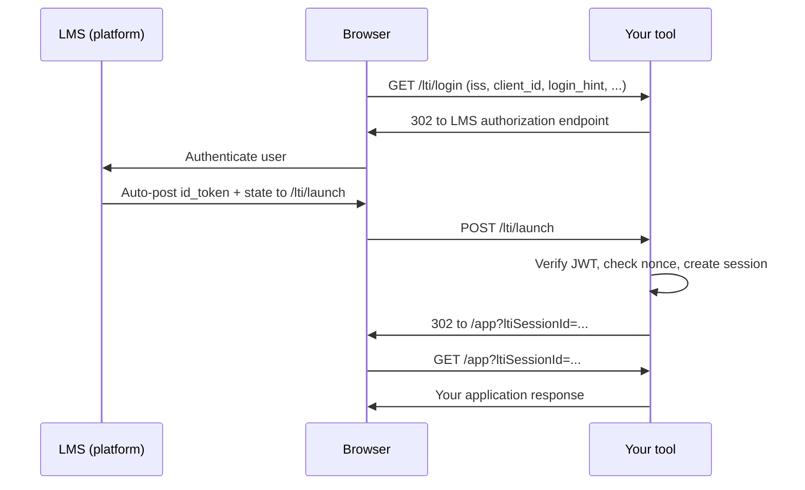

# LTI Tool

A TypeScript library for building [LTI 1.3](https://www.imsglobal.org/spec/lti/v1p3) tools that run on Node.js, Cloudflare Workers, AWS Lambda, and other modern runtimes.

Built on [lti-tool/lti-tool](https://github.com/lti-tool/lti-tool).

[](https://www.npmjs.com/package/@longsightgroup/lti-tool)
[](https://github.com/LongsightGroup/lti-tool/actions/workflows/ci.yml)

## What this is

An LMS (Canvas, Brightspace, Moodle, Sakai, Blackboard, and others) launches your application inside an iframe using LTI 1.3. That launch is an OIDC login flow: the platform redirects the browser to your tool, your tool redirects back to the platform, and the platform posts a signed ID token to your launch endpoint. Your tool verifies that token, learns who the user is and which course they came from, and then serves content.

LTI Tool handles that protocol work so you can focus on your application:

- OIDC third-party login and launch verification
- Session management without relying on third-party cookies
- LTI Advantage services: grades (AGS), rosters (NRPS), deep linking, and dynamic registration
- Pluggable storage for platform configuration, sessions, and nonces
- Optional [Hono](https://hono.dev) route handlers for the standard LTI endpoints

The package ships as a single npm module with subpath exports. Install once, import only what you need.

## Install

```bash
npm install @longsightgroup/lti-tool hono
```

Storage adapters pull in optional peer dependencies (`postgres`, `mysql2`, `@aws-sdk/client-dynamodb`, `drizzle-orm`, and others). Install the backend you actually use.

## Quick start

This example wires up the three endpoints every LTI 1.3 tool needs, registers a Moodle sandbox platform, and protects a route with the launch session.

```typescript
import { Hono } from 'hono';
import { LTITool, upsertLaunchRegistration } from '@longsightgroup/lti-tool';
import { createLtiRoutes, secureLTISession } from '@longsightgroup/lti-tool/hono';
import { MemoryStorage } from '@longsightgroup/lti-tool/storage/memory';

const keyPair = await crypto.subtle.generateKey(
  {
    name: 'RSASSA-PKCS1-v1_5',
    modulusLength: 2048,
    publicExponent: new Uint8Array([1, 0, 1]),
    hash: 'SHA-256',
  },
  true,
  ['sign', 'verify'],
);

const ltiConfig = {
  stateSecret: new TextEncoder().encode('use-a-random-secret-at-least-32-bytes'),
  keyPair,
  storage: new MemoryStorage(),
};

const ltiTool = new LTITool(ltiConfig);

await upsertLaunchRegistration(ltiConfig.storage, {
  name: 'Moodle Sandbox',
  iss: 'https://sandbox.moodledemo.net',
  clientId: 'your-client-id',
  deploymentId: 'your-deployment-id',
  jwksUrl: 'https://sandbox.moodledemo.net/mod/lti/certs.php',
  authUrl: 'https://sandbox.moodledemo.net/mod/lti/auth.php',
  tokenUrl: 'https://sandbox.moodledemo.net/mod/lti/token.php',
});

const app = new Hono();

app.route('/lti', createLtiRoutes({ ltiTool }));

app.use('/app/*', secureLTISession(ltiTool));
app.get('/app', (c) => {
  const session = c.get('ltiSession');
  return c.json({ hello: session.user.name, course: session.context?.title });
});
```

After a successful launch, the library redirects the browser to your target URL with an `ltiSessionId` query parameter. Protected routes read that parameter to load the session.

In production, load your RSA private JWK and `stateSecret` from a secrets manager instead of generating them at startup. `importLtiToolKeyPairFromJwk` imports private RSA JWK JSON, preserves or derives the key ID, and returns the public JWKS material for custom keyset endpoints:

```typescript
import { importLtiToolKeyPairFromJwk } from '@longsightgroup/lti-tool';

const keyMaterial = await importLtiToolKeyPairFromJwk(privateJwkJson);
const ltiConfig = {
  stateSecret,
  keyPair: keyMaterial.keyPair,
  storage,
  security: { keyId: keyMaterial.keyId },
};
```

`MemoryStorage` is for development and tests only.

## How a launch works



The library verifies the ID token signature against the platform JWKS, validates the OAuth state and nonce, confirms the client ID and deployment ID match your stored configuration, and persists a session you can use for later LTI service calls.

## Core concepts

| Concept           | What it is                                                                                                                               |
| ----------------- | ---------------------------------------------------------------------------------------------------------------------------------------- |
| **Client**        | A registered LMS platform (issuer URL, OAuth client ID, auth/token/JWKS endpoints).                                                      |
| **Deployment**    | A specific tool installation on that platform, identified by `deployment_id` in the launch.                                              |
| **Launch config** | Cached platform + deployment metadata used on the hot launch path. Created automatically by `upsertLaunchRegistration`.                  |
| **Session**       | The verified launch context: user, roles, course, resource link, and available LTI services. Referenced by `ltiSessionId`.               |
| **Storage**       | Persistence for clients, deployments, sessions, nonces, and dynamic-registration state. Swap adapters without changing application code. |

## Registering a platform

Every launch needs a stored client (platform) and deployment (tool installation). Pass the values your LMS administrator gives you in one call:

```typescript
await upsertLaunchRegistration(ltiConfig.storage, {
  name: 'Moodle Sandbox',
  iss: 'https://sandbox.moodledemo.net',
  clientId: 'your-client-id',
  deploymentId: 'your-deployment-id',
  authUrl: 'https://sandbox.moodledemo.net/mod/lti/auth.php',
  tokenUrl: 'https://sandbox.moodledemo.net/mod/lti/token.php',
  jwksUrl: 'https://sandbox.moodledemo.net/mod/lti/certs.php',
});
```

`upsertLaunchRegistration` creates or updates the client and deployment, then refreshes the cached launch config used during launch verification. Call it again when endpoints or deployment metadata change.

For Canvas Cloud, derive the issuer and platform endpoints from the Canvas environment:

```typescript
import {
  resolveCanvasPlatformBinding,
  upsertLaunchRegistration,
} from '@longsightgroup/lti-tool';

await upsertLaunchRegistration(storage, {
  name: 'Canvas',
  clientId: 'your-client-id',
  deploymentId: 'your-deployment-id',
  ...resolveCanvasPlatformBinding('production'),
});
```

For self-service administrator registration, use `LtiDynamicRegistration` instead of hand-copying IDs.

## Package exports

Everything installs as `@longsightgroup/lti-tool`. Import subpaths for adapters and framework helpers.

| Import                                        | Purpose                                                      |
| --------------------------------------------- | ------------------------------------------------------------ |
| `@longsightgroup/lti-tool`                    | `LTITool`, schemas, launch verification, LTI service helpers |
| `@longsightgroup/lti-tool/hono`               | Route handlers and session middleware                        |
| `@longsightgroup/lti-tool/testing`            | Test builders and fake LTI Advantage clients                 |
| `@longsightgroup/lti-tool/storage/memory`     | In-memory storage (dev/test)                                 |
| `@longsightgroup/lti-tool/storage/dynamodb`   | DynamoDB (AWS Lambda, serverless)                            |
| `@longsightgroup/lti-tool/storage/postgresql` | PostgreSQL via Drizzle                                       |
| `@longsightgroup/lti-tool/storage/mysql`      | MySQL via Drizzle                                            |
| `@longsightgroup/lti-tool/storage/d1`         | Cloudflare D1                                                |

Implement the `LTIStorage` interface yourself if you need Redis, another database, or a custom control plane.

## Hono routes

`createLtiRoutes` mounts the standard LTI protocol endpoints on a Hono sub-app:

```typescript
app.route(
  '/lti',
  createLtiRoutes({
    ltiTool,
    onVerificationEvent: ({ hono, event }) => {
      hono.executionCtx.waitUntil(auditLaunchVerification(event));
    },
  }),
);
```

This registers `/lti/jwks`, `/lti/login` (GET and POST), and `/lti/launch` (POST).
Use `onVerificationEvent` to record safe launch verification audit events from the
framework layer. In Workers, schedule asynchronous writes with `waitUntil`.

For app-owned launch UI, use `customLaunchRouteHandler`. It performs form parsing,
launch verification, session creation, and launch-message resolution, then calls your
Resource Link or Deep Linking renderer with the verified launch, session, message, Hono
context, and session-bound Advantage client.

```typescript
import {
  customLaunchRouteHandler,
  renderDefaultLaunchVerificationFailureResponse,
} from '@longsightgroup/lti-tool/hono';

app.post(
  '/lti/launch',
  customLaunchRouteHandler({
    ltiTool,
    logger,
    onVerificationEvent: ({ hono, event }) => {
      hono.executionCtx.waitUntil(auditLaunchVerification(event));
    },
    onVerificationFailure: (context) =>
      context.error.code === 'launch_config_missing_jwks_endpoint'
        ? context.hono.json({ error: 'Platform registration incomplete' }, 501)
        : renderDefaultLaunchVerificationFailureResponse(context),
    renderResourceLink: ({ hono, session }) => hono.html(renderBadge(session)),
    renderDeepLinkingRequest: ({ hono, message }) => hono.html(renderPicker(message)),
  }),
);
```

Use `onVerificationFailure` on `customLaunchRouteHandler` to map typed launch verification
failures to app-specific HTTP responses while keeping verification result-based. Compose with
`renderDefaultLaunchVerificationFailureResponse` when you only need to override selected
error codes. `launchRouteHandler` keeps the built-in default mapping and does not accept
this hook.

Mount deep linking or dynamic registration explicitly when you need them:

```typescript
import { LtiDynamicRegistration } from '@longsightgroup/lti-tool';
import {
  completeDynamicRegistrationRouteHandler,
  createLtiOptionalRouteDeps,
  deepLinkRouteHandler,
  initiateDynamicRegistrationRouteHandler,
} from '@longsightgroup/lti-tool/hono';

const dynamicRegistration = new LtiDynamicRegistration(ltiConfig);
const optionalRoutes = createLtiOptionalRouteDeps({
  ltiTool,
  dynamicRegistration,
  logger,
  getDynamicRegistrationAppState: ({ hono }) => ({
    tenantId: yourTenantIdFromTrustedHost(hono.req.header('host')),
  }),
  onRegistrationComplete: async ({ client, deployment, appState }) => {
    await saveTenantRegistration({ client, deployment, appState });
  },
});

app.get('/lti/deep-linking', deepLinkRouteHandler(optionalRoutes.deepLink));
app.get(
  '/lti/register',
  initiateDynamicRegistrationRouteHandler(optionalRoutes.initiateDynamicRegistration),
);
app.post(
  '/lti/register/complete',
  completeDynamicRegistrationRouteHandler(optionalRoutes.completeDynamicRegistration),
);
```

`secureLTISession` middleware validates `ltiSessionId` on incoming requests and sets `ltiSession` on the Hono context. Mount it on your application paths, not on the LTI protocol routes.
Non-Hono apps can use `requireLtiSession({ storage, sessionId })` to load a
session with typed `invalid_session_id`, `session_not_found`, and
`session_storage_failed` results instead of translating `undefined` themselves.

### Individual route handlers (advanced)

Each handler accepts a small protocol-facing dependency object for tests and custom wiring:

| Route handler                             | Method(s) | Endpoint (convention)                                      |
| ----------------------------------------- | --------- | ---------------------------------------------------------- |
| `jwksRouteHandler`                        | GET       | `/lti/jwks` — your tool's public keys                      |
| `loginRouteHandler`                       | GET, POST | `/lti/login` — OIDC login initiation                       |
| `launchRouteHandler`                      | POST      | `/lti/launch` — ID token verification and session creation |
| `deepLinkRouteHandler`                    | GET       | `/lti/deep-linking` — deep linking content selection UI    |
| `initiateDynamicRegistrationRouteHandler` | GET       | `/lti/register` — start dynamic registration               |
| `completeDynamicRegistrationRouteHandler` | POST      | `/lti/register/complete` — finish dynamic registration     |

You can also use the core `LTITool` class directly without Hono — call `handleLogin`, `verifyLaunch`, and `createSessionFromVerifiedLaunch` from your own framework.

## LTI Advantage services

Once you have a session, create a session-bound Advantage facade:

```typescript
const advantage = ltiTool.createAdvantage(session);
await advantage.submitScore(score);
await advantage.submitScore(score, {
  lineItemUrl: 'https://platform.example.com/ags/lineitems/selected',
});
const roster = await advantage.getMembers();
const fullRoster = await advantage.getMembers({ followPagination: true });
const deepLink = await advantage.createDeepLinkingResponse(contentItems);
if (deepLink.success) {
  // deepLink.data is the auto-submit HTML form
}
```

`LtiAdvantage` can call platform services on the user's behalf:

- **AGS** — submit scores, manage line items, read results (`submitScore`, `createLineItem`, `findOrCreateLineItem`, `getScores`, and related methods)
- **NRPS** — fetch course membership (`getMembers`, `getMembersPage`; use `{ followPagination: true }` for large rosters)
- **Deep linking** — return content items to the platform (`createDeepLinkingResponse`)

Deep Linking launches expose normalized platform settings at
`session.services.deepLinking`, including `acceptTypes`,
`acceptPresentationDocumentTargets`, and optional `acceptLineItem` support for
platforms that allow returned resource links to include AGS line item metadata.
Resource link content items built with `createLtiResourceLinkContentItem` can
include standard `window` and `iframe` presentation options plus
`presentation.documentTarget` when a platform expects that field.

For routes that need an HTTP response directly, call
`createDeepLinkingHtmlResponse(contentItems)` for a typed `LtiServiceResult<Response>`
with `text/html` and `no-store` headers.

Applications and tests can depend on the exported small interfaces:
`LtiToolPort`, `LtiAdvantagePort`, `LtiAgsClient`, `LtiNrpsClient`, and
`LtiDeepLinkingClient`.

Use `LtiDynamicRegistration` for administrator self-service registration.
Dynamic registration can be customized per platform while keeping the same package
entry point. Canvas, Brightspace, Moodle, and Sakai support placement configuration;
final hooks can adjust the resolved messages or payload before the request is posted
to the LMS.

```typescript
import {
  buildCanvasStaticRegistrationConfig,
  type DynamicRegistrationConfig,
} from '@longsightgroup/lti-tool';

const dynamicRegistrationConfig: DynamicRegistrationConfig = {
  url: 'https://tool.example.com',
  name: 'Example Tool',
  description: 'Example Tool course content.',
  platforms: {
    canvas: {
      resourceLinkPlacements: ['course_navigation'],
      deepLinkPlacements: ['editor_button', 'assignment_selection'],
      privacyLevel: 'public',
      toolId: 'example-tool',
    },
    brightspace: {
      deepLinkPlacements: ['editor_button'],
    },
    moodle: {
      deepLinkPlacements: ['editor_button', 'activity_chooser'],
    },
    sakai: {
      deepLinkPlacements: ['editor_button'],
    },
  },
  customizeMessages: (_context, messages) => messages,
  customizePayload: (_context, payload) => ({
    ...payload,
    client_uri: 'https://tool.example.com/admin/lti',
  }),
};

const ltiConfig = {
  // stateSecret, keyPair, storage...
  dynamicRegistration: dynamicRegistrationConfig,
};

const canvasJson = buildCanvasStaticRegistrationConfig({
  config: dynamicRegistrationConfig,
  selectedServices: ['ags', 'nrps', 'deep_linking'],
});
```

Canvas static JSON requires `description` and `platforms.canvas.privacyLevel`.

`appState` values passed to `initiateDynamicRegistration` or returned from Hono
`getDynamicRegistrationAppState` are stored with the temporary registration session
and returned in `LtiDynamicRegistrationCompletionResult`. They must be JSON values.
Define your own Zod schema in application code when you need typed customization hooks.
`initiateDynamicRegistration` returns `{ html, sessionToken }`, so non-Hono callers
can render the generated form or complete a programmatic registration without scraping
the hidden session token out of the HTML.

`platforms` is keyed by built-in profile key (`canvas`, `brightspace`, `moodle`,
or `sakai`). Add the key to the public config type and built-in profile table when
you need first-class support for a new LMS.

The Hono `onRegistrationComplete` callback runs after core stores the client,
deployment, and launch config. If the callback throws, the route logs the failure
and still returns the registration success HTML. The LMS registration has already
succeeded at that point, so applications should treat callback failures as requiring
reconciliation.

Service availability depends on what the platform enabled for the deployment. Helper functions like `isLtiAgsAvailable` and `isLtiNrpsAvailable` inspect the session claims.

## Storage adapters

| Adapter            | Best for                      | Notes                                                  |
| ------------------ | ----------------------------- | ------------------------------------------------------ |
| Memory             | Local development, unit tests | No persistence across restarts                         |
| DynamoDB           | AWS serverless                | Three-table design with TTL for sessions and nonces    |
| PostgreSQL / MySQL | Traditional deployments       | Drizzle schemas and migrations included in the package |
| D1                 | Cloudflare Workers            | SQLite-compatible edge database                        |

Each SQL adapter ships with a `drizzle.config.ts` and generated migration files. The Drizzle schema files are the source of truth; use `npm run db:generate:*` after schema changes and `npm run db:check:migrations` before publishing migration changes. Run Drizzle commands from the monorepo root so the config paths resolve correctly. See the README in `packages/postgresql`, `packages/mysql`, or `packages/d1` for setup commands.

Each storage instance owns one tenant namespace. Shared storage adapters require `tenantId` when constructed; create one storage instance per tenant. `MemoryStorage` follows the same boundary through instance lifetime and does not take a tenant configuration value. PostgreSQL also enforces that boundary with row-level security; DynamoDB, MySQL, and D1 enforce it through their adapter query scope.

Storage `getLaunchConfig` methods return exact deployment matches only. The core launch flow owns default-deployment resolution.

## Test with Moodle sandbox

[Moodle's public sandbox](https://sandbox.moodledemo.net/) is a free way to exercise a real launch.

1. Log in as administrator (credentials are on the site).
2. Go to **Site administration → Plugins → External tool → Manage tools**.
3. Choose **configure a tool manually** and set:

| Field              | Value                                |
| ------------------ | ------------------------------------ |
| Tool URL           | `https://your-domain.com`            |
| LTI version        | LTI 1.3                              |
| Public key type    | Keyset URL                           |
| Public keyset      | `https://your-domain.com/lti/jwks`   |
| Login URL          | `https://your-domain.com/lti/login`  |
| Redirection URI(s) | `https://your-domain.com/lti/launch` |

4. Enable AGS, NRPS, and deep linking if you want to test those services.
5. After saving, open the tool details (magnifying glass icon) and copy the **Client ID** and **Deployment ID** into `upsertLaunchRegistration`.
6. Add the tool to a course as an **External tool** activity and launch it.

For local development, expose your server with a tunnel (ngrok, Cloudflare Tunnel, etc.) so the sandbox can reach your endpoints.

## Security

- JWT signatures are verified against the platform JWKS.
- OAuth `state` and `nonce` values are validated to prevent CSRF and replay attacks.
  Nonces are atomically claimed by storage during launch verification; storage adapters
  own nonce TTL configuration.
- Client ID and deployment ID must match stored configuration.
- Sessions are referenced by ID in the URL, not browser cookies — this works inside LMS iframes where third-party cookies are blocked.

Use a strong, random `stateSecret` (32+ bytes). Store your RSA private key in a secrets manager (AWS KMS, Parameter Store, Vault, etc.). Never commit keys or secrets to source control.

## Documentation

- [Contributing](CONTRIBUTING.md)
- [Issues](https://github.com/LongsightGroup/lti-tool/issues)
- [Discussions](https://github.com/LongsightGroup/lti-tool/discussions)

## License

MIT
